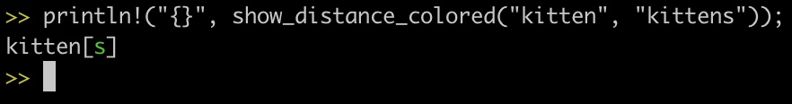

[](https://github.com/etorreborre/rust-edits/actions?query=workflow%3A%22CI%22)

This library provides functions to show the differences between two strings.
It uses the [Levenshtein distance](https://en.wikipedia.org/wiki/Levenshtein_distance) to compute
the minimum number of edit operations: insertions, deletions, substitutions needed to go from one string to the other.

Several options are available to customize this processing:

  - `split_size` strings are broken into a list of lines if they contain any new lines first.
     Then if any line is too large, according to the `split_size` it is broken into smaller pieces for comparison
     This is done in order to reduce the size of the edit matrix which is used to compute all the edit costs
     The default is 200

  - `separators` opening and closing pieces of text (brackets by default) used to highlight a difference

  - `shorten size` there is the possibly to display mostly the differences with a bit of context around if the input text is too large.
      The string get elided around separators if it gets greater than the `shorten_size` (the default is 20)

  - `shorten_text` the string to use when eliding characters in the original string (the default is `"..."`)

  - `display_edit_operations` a function to specify how edit operations, insert/delete/substitute/keep are represented

 Here are some examples:
```rust
use edits::edits::*;

// "between the e and the n the letter i was added"
assert_eq!(show_distance("kitten", "kittein"), "kitte[+i]n");

// "at the end of the text 3 letters have been deleted"
assert_eq!(show_distance("kitten", "kit"), "kit[-t-e-n]");

// "between the t and the n 2 letters have been modified"
assert_eq!(show_distance("kitten", "kitsin"), "kit[~t/s~e/i]n");

// "between the t and the n 2 letters have been modified"
let my_split_size = SplitSize { split_size: 300 };
assert_eq!(show_distance_with(my_split_size, default_display_options(), "kitten", "kitsin"), "kit[~t/s~e/i]n");
```

The output can also be coloured. For example:


## Try it in a REPL

You can try this library in a REPL:

 - install [flox](https://floxdev.com)
 - clone this repository
 - invoke `flox develop`
 - start the `evcxr` repl:
```sh
[flox] λ evcxr
Welcome to evcxr. For help, type :help
>>
```

 - add the current path as a dependency and import the `edits` module

```sh
>> :dep edits = { path = "." }
>> use edits::edits::*;
```

 - use a `show` function
```sh
>> println!("{}", show_distance_colored("abcd", "abcdefg"));
abcd[efg]
```

## Build the package

Building the package is easy with flox!
```sh
sh> flox build
```

... after which you can invoke the package using the `./result` symlink:
```sh
sh> ./result/bin/edits
abcd[efg]
```

## Publish the package

You can publish your package for installation by yourself and others.
```sh
sh> flox publish
Enter upstream URL for source backed builds: (enter '.' to effectively disable source builds on remote machines): git@github.com/etorreborre/rust-edits.git
Enter publish URL (enter '.' to publish to current directory): git@github.com:etorreborre/floxpkgs
Cloning git@github.com:etorreborre/floxpkgs ...
Cloning into '/tmp/nix-shell.Ycun50/tmp.p1zze1qRT1'...
remote: Enumerating objects: 261, done.
remote: Counting objects: 100% (26/26), done.
remote: Compressing objects: 100% (12/12), done.
remote: Total 261 (delta 11), reused 17 (delta 8), pack-reused 235
Receiving objects: 100% (261/261), 33.76 KiB | 360.00 KiB/s, done.
Resolving deltas: 100% (86/86), done.
Building edits ...
warning: 'https://beta.floxdev.com/floxchan' does not appear to be a binary cache
publishing render to catalog ...
flox publish completed
[master 98c4559] eric published .#edits
 1 file changed, 91 insertions(+)
 create mode 100644 catalog/x86_64-linux/stable/edits/0.0.0.json
Enumerating objects: 11, done.
Counting objects: 100% (11/11), done.
Delta compression using up to 8 threads
Compressing objects: 100% (4/4), done.
Writing objects: 100% (7/7), 1.24 KiB | 1.24 MiB/s, done.
Total 7 (delta 2), reused 0 (delta 0), pack-reused 0
remote: Resolving deltas: 100% (2/2), completed with 2 local objects.
To github.com:etorreborre/floxpkgs.git
   9bd0f41..98c4559  master -> master
sh>
```

## Install the package

First subscribe to your channel:
```sh
sh> flox subscribe
Enter channel name to be added: etorreborre
Enter URL for 'etorreborre' channel: github:etorreborre/floxpkgs/master
```

Then search and install!
```sh
sh> flox search -c etorreborre edits
etorreborre.edits
  stable.etorreborre.edits@0.0.0
sh> flox install stable.etorreborre.edits
sh> flox activate -- edits
abcd[efg]
sh>
```
